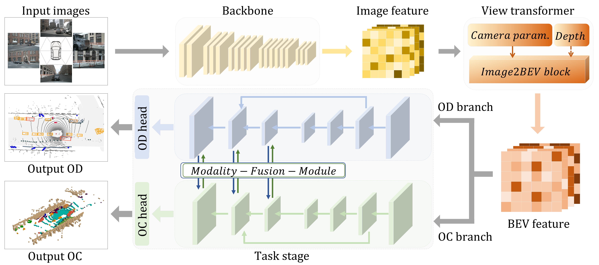

# SOGDet: Semantic-Occupancy Guided Multi-view 3D Object Detection

The official implementation of SOGDet.

> ### [SOGDet: Semantic-Occupancy Guided Multi-view 3D Object Detection](https://ojs.aaai.org/index.php/AAAI/article/download/28600/29167)
> [Qiu Zhou](https://scholar.google.com/citations?user=vosYoZUAAAAJ),
> [Jinming Cao](https://scholar.google.com/citations?user=GSte8PMAAAAJ), 
> [Hanchao Leng](https://scholar.google.com/citations?user=sTf4klUAAAAJ), 
> [Yifang Yin](https://scholar.google.com/citations?user=TRfTdBAAAAAJ),
> Kun Yu,
> [Roger Zimmermann](https://scholar.google.com/citations?user=IDREwXEAAAAJ), 
> *AAAI 2024.*

## Introduction

We propose a novel approach called SOGDet
(Semantic-Occupancy Guided Multi-view 3D Object Detection), 
that leverages a 3D semantic-occupancy branch to improve 
the accuracy of 3D object detection. In particular, the
physical context modeled by semantic occupancy helps the
detector to perceive the scenes in a more holistic view. Our
SOGDet is flexible to use and can be seamlessly integrated
with most existing BEV-based methods. 



## Usage
### Main Results

| Method                                                           | mAP      | NDS     |   Model |
|------------------------------------------------------------------|----------|---------|--------|
| [**SOGDet-BO-r50**](configs/bev_exp/sogdet-bo-r50-2keys-cbgs.py) | 38.2     | 50.2    | [google](https://drive.google.com/file/d/1fGwb2Jy7myZrrRYTnTyg6R4b1bI_ipnH)  |
| [**SOGDet-SE-r50***](configs/bev_exp/sogdet-se-r50-2keys-cbgs.py) | 38.8     | 50.6    | [google](https://drive.google.com/file/d/1iNixRbGuDfrTyRZgOcBwkaYdGssS7kT4)  |
| [**SOGDet-BO-r101**](configs/bev_exp/sogdet-bo-r101-2keys-cbgs.py) | 43.9     | 55.4    | [google](https://drive.google.com/file/d/17qyBhH6SO3FpHmvLwIx1i1qjnA348OIF)  |
| [**SOGDet-SE-r101***](configs/bev_exp/sogdet-se-r101-2keys-cbgs.py) | 45.8     | 56.6    | [google](https://drive.google.com/file/d/1QMKhrNdruoQ_eQMaTldye6tRs2AtFK60)  | 
* Memory is tested in the training process with batch 1 and without using torch.checkpoint.


### Environment Installation 
Please see [install.md](docs/install.md).


### Data Preparation
Please see [install.md](docs/data_preparation.md).

### Train
For training process, we use config file in `$SOGDet/configs/sogdet` to define model, dataset and hyber parameters.
Run the following command to start a training process.
For example:
```bash
tools/dist_train.sh configs/sogdet-se-r50.py 8 
```

### Test
For testing bbox scores, run the following command:
```
tools/dist_test.sh configs/sogdet-se-r50.py sogdet-se-r50.pth 8 --eval bbox  
```
For testing bbox & mIOU scores, run the following command:
```
tools/dist_test_plus.sh configs/sogdet-se-r50.py sogdet-se-r50.pth 8 --eval bbox
```


### Visualization
For visualizing results, we should add parameter '--show-dir xxx' to save results during running test commands.
For example:
```bash
tools/dist_test.sh configs/sogdet-se-r50.py sogdet-se-r50.pth 8 --eval bbox --show-dir work_dirs/sogdet-se-r50/  # for OD results
python tools/test_plus.py configs/sogdet-se-r50.py sogdet-se-r50.pth --eval bbox --show-dir work_dirs/sogdet-se-r50/  # for OCC results (no multi-process)
```

Run the following command to visualize OD & OCC visualization results.
```
python tools/vis_pred_gt_od_hybrid.py --bbox-path work_dirs/sogdet-se-r50/ --voxel-path work_dirs/sogdet-se-r50/ --save-path work_dirs/sogdet-se-r50/visual_pred/
python tools/vis_pred_gt_occ.py --voxel-path work_dirs/sogdet-se-r50/ --save-path work_dirs/sogdet-se-r50/
```

## Citation
If you find this repo useful, please consider citing:
```
@inproceedings{zhou2024sogdet,
  title={SOGDet: Semantic-occupancy guided multi-view 3D object detection},
  author={Zhou, Qiu and Cao, Jinming and Leng, Hanchao and Yin, Yifang and Kun, Yu and Zimmermann, Roger},
  booktitle={Proceedings of the AAAI Conference on Artificial Intelligence},
  volume={38},
  number={7},
  pages={7668--7676},
  year={2024}
}
```

## Acknowledgement
This project is not possible without multiple great open-sourced code bases. We list some notable examples below.
* [open-mmlab](https://github.com/open-mmlab) 
* [CenterPoint](https://github.com/tianweiy/CenterPoint)
* [Lift-Splat-Shoot](https://github.com/nv-tlabs/lift-splat-shoot)
* [Swin Transformer](https://github.com/microsoft/Swin-Transformer)
* [BEVDet](https://github.com/HuangJunJie2017/BEVDet)
* [BEVDepth](https://github.com/Megvii-BaseDetection/BEVDepth)

